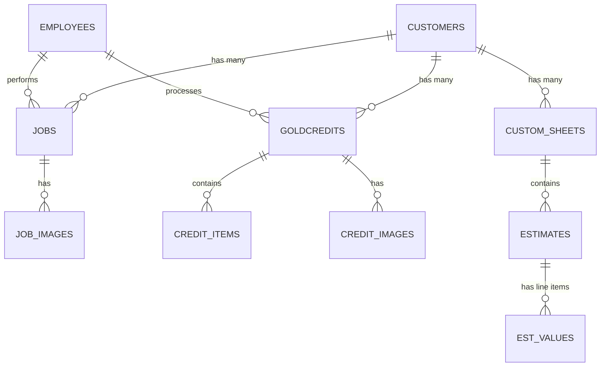

# Jewelry Sale & Repair Store Backend (Cibola2)

This repository is a modern, lightweight rewrite of a legacy Laravel backend, built specifically to power a custom application for a small jewelry sale and repair store. 

This README serves as a comprehensive system prompt and context document for AI agents developer-onboarding to this codebase. It documents the architecture, database schema, API routing, business rules, and design choices.

---

## 🎯 Project Goals & Design Principles

1. **In-place Replacement**: The application is designed to connect directly to the existing legacy SQLite database (`database.sqlite`) and operate without schema discrepancies.
2. **Independent Initialization**: The application has an auto-migration and seeding setup in `src/db.js` allowing it to build and seed a functional database from scratch if the DB file is missing or empty.
3. **Zero Authentication (LAN Only)**: The app is hosted on a local Windows PC in the store's basement. Access is limited strictly to the local area network (LAN), so no authentication layers are required.
4. **Local File Storage**: Uploaded image assets (job photos and scrap metal credit photos) are saved to the local filesystem.
5. **Simplicity Over ORM Complexity**: The stack relies on **Express** and **`better-sqlite3`**. Database access is performed using direct, synchronous SQLite queries to avoid ORM bloat and performance overhead.

---

## 🛠️ Technology Stack

* **Runtime**: Node.js
* **Framework**: Express.js
* **Database Driver**: `better-sqlite3` (synchronous SQLite client for Node.js)
* **Middleware**: `cors` (for cross-origin requests), `express.json` (configured with a 50MB payload limit to handle Base64 images)
* **Configuration**: `dotenv`

---

## 📂 Project Structure

```text
cibola2/
├── .env                  # Port, SQLite path, and uploads directory config
├── package.json          # Dependency listings and start/dev scripts
├── src/
│   ├── index.js          # Server entry point, middleware, static routing, and route mounts
│   ├── db.js             # SQLite connection, DDL table definitions, and seeder logic
│   └── routes/
│       ├── customers.js     # /customers endpoints & customer delete cascade logic
│       ├── employees.js     # /employees endpoints & outstanding jobs nested queries
│       ├── jobs.js          # /jobs endpoints, Base64 uploads, 12-month stats, & image delete
│       ├── values.js        # /values lookup configs, karat definitions, & price feed stubs
│       ├── credits.js       # /goldcredit endpoints, item arrays, & base64 credit images
│       └── customSheets.js  # /customsheet endpoints with nested estimates & values delta engine
└── public/               # Default local uploads directory (git-ignored)
```

---

## 💾 Database Schema

The database consists of 11 interrelated SQLite tables. Reserved keywords (like `"values"`, `"order"`) must always be escaped in double-quotes in SQL statements.



### Table Definitions

#### 1. `customers`
Stores customer records and custom notes.
* `id` (INTEGER PRIMARY KEY AUTOINCREMENT)
* `fname` (TEXT, NOT NULL)
* `lname` (TEXT, NOT NULL)
* `phone` (TEXT, Nullable)
* `email` (TEXT, Nullable)
* `addr_st` (TEXT, Nullable)
* `addr_city` (TEXT, Nullable)
* `addr_prov` (TEXT, Nullable)
* `addr_postal` (TEXT, Nullable)
* `addr_country` (TEXT, Nullable)
* `note` (TEXT, Nullable)
* `created_at`, `updated_at` (DATETIME)

#### 2. `employees`
Stores employee records. 
* `id` (INTEGER PRIMARY KEY AUTOINCREMENT)
* `name` (TEXT, NOT NULL)
* `active` (INTEGER, Default 1 - acts as Boolean)
* `created_at`, `updated_at` (DATETIME)
* *Note: Employee ID 1 ("Unassigned") is protected and cannot be deleted.*

#### 3. `jobs`
Main ticket records for sales and repair jobs.
* `id` (INTEGER PRIMARY KEY AUTOINCREMENT)
* `customer_id` (INTEGER, Foreign Key to `customers.id`)
* `employee_id` (INTEGER, Foreign Key to `employees.id`, Default 1)
* `estimate` (REAL, Default 0)
* `est_note` (TEXT, Nullable)
* `note` (TEXT, Nullable)
* `appraisal` (INTEGER, Boolean, Default 0)
* `vital_date` (INTEGER, Boolean, Default 0)
* `due_date` (TEXT, YYYY-MM-DD, Nullable)
* `completed_at` (TEXT, YYYY-MM-DD, Nullable)
* `deposit` (REAL, Nullable)
* `created_at`, `updated_at` (DATETIME)

#### 4. `job_images`
Images linked to repair/sale jobs.
* `id` (INTEGER PRIMARY KEY AUTOINCREMENT)
* `job_id` (INTEGER, Foreign Key to `jobs.id` ON DELETE CASCADE)
* `note` (TEXT, Nullable)
* `image` (TEXT, stores URL path e.g. `/storage/job1-3.png`)
* `created_at`, `updated_at` (DATETIME)

#### 5. `goldcredits`
Scrap metal trade-ins.
* `id` (INTEGER PRIMARY KEY AUTOINCREMENT)
* `customer_id` (INTEGER, Foreign Key to `customers.id`)
* `employee_id` (INTEGER, Foreign Key to `employees.id`, Default 1)
* `gold_cad` (REAL, CAD price per gram during transaction)
* `plat_cad` (REAL, Platinum price per gram during transaction)
* `gold_date` (TEXT, transaction date)
* `note` (TEXT, Nullable)
* `used` (INTEGER, Boolean, Default 0)
* `credit_type` (TEXT, Default 'credit')
* `created_at`, `updated_at` (DATETIME)

#### 6. `credit_items`
Itemized scrap components (e.g. 14k ring weight, markup).
* `id` (INTEGER PRIMARY KEY AUTOINCREMENT)
* `goldcredit_id` (INTEGER, Foreign Key to `goldcredits.id` ON DELETE CASCADE)
* `itemId` (INTEGER, references Karat row ID in `"values"`)
* `markup` (REAL)
* `multiplier` (REAL)
* `value` (REAL, calculated credit value)
* `weight` (REAL, weight in grams)
* `created_at`, `updated_at` (DATETIME)

#### 7. `credit_images`
Photos of scrap items traded in.
* `id` (INTEGER PRIMARY KEY AUTOINCREMENT)
* `goldcredit_id` (INTEGER, Foreign Key to `goldcredits.id` ON DELETE CASCADE)
* `note` (TEXT, Nullable)
* `image` (TEXT, stores URL path e.g. `/storage/credit1-1.png`)
* `created_at`, `updated_at` (DATETIME)

#### 8. `"values"`
Configuration table for Karats, diamonds, other base rates, and metal spot price caching.
* `id` (INTEGER PRIMARY KEY AUTOINCREMENT)
* `type_id` (INTEGER, 1 = Config/Ratio, 2 = Spot price cache)
* `name` (TEXT, e.g. '14k', 'GoldCAD', 'PlatCAD')
* `value1` (TEXT, Nullable - stores gold ratio, base cost, or current gram rate)
* `value2` (TEXT, Nullable - stores markup multiplier)
* `value3` (TEXT, Nullable - category description)
* `value4` (TEXT, Nullable)
* `"order"` (TEXT, sorting value)
* `active` (INTEGER, Default 1 - Boolean)
* `created_at`, `updated_at` (DATETIME)

#### 9. `custom_sheets`
Parent records for custom jewelry designs.
* `id` (INTEGER PRIMARY KEY AUTOINCREMENT)
* `customer_id` (INTEGER, Foreign Key to `customers.id`)
* `name` (TEXT)
* `note` (TEXT, Nullable)
* `created_at`, `updated_at` (DATETIME)

#### 10. `estimates`
Individual estimates (quoting iterations) within a custom design sheet.
* `id` (INTEGER PRIMARY KEY AUTOINCREMENT)
* `custom_sheet_id` (INTEGER, Foreign Key to `custom_sheets.id` ON DELETE CASCADE)
* `name` (TEXT)
* `note` (TEXT, Nullable)
* `isPrimary` (INTEGER, Boolean, Default 0)
* `created_at`, `updated_at` (DATETIME)

#### 11. `est_values`
Itemized material and labor lines (e.g. diamonds, gold casting, setting fee) for an estimate.
* `id` (INTEGER PRIMARY KEY AUTOINCREMENT)
* `estimate_id` (INTEGER, Foreign Key to `estimates.id` ON DELETE CASCADE)
* `name` (TEXT, Default 'unknown')
* `type` (TEXT)
* `priceType` (TEXT, Nullable)
* `amt` (REAL, quantity/amount, Default 0)
* `pricePer` (REAL, cost per unit, Default 0)
* `created_at`, `updated_at` (DATETIME)

---

## ⚙️ Core Business Logic & Cascading Rules

### 1. Deletion Cascades (Disk Cleanups)
To prevent orphan assets accumulating on the Windows PC hard drive, backend deletion logic intercepts database deletions and unlinks the corresponding files:
* **Delete Customer**: 
  1. Finds all associated jobs -> unlinks files for all their `job_images` -> deletes `job_images` records -> deletes `jobs`.
  2. Finds all custom sheets -> deletes associated `est_values` -> deletes `estimates` -> deletes `custom_sheets`.
  3. Finds all gold credits -> unlinks files for all `credit_images` -> deletes `credit_images` -> deletes `credit_items` -> deletes `goldcredits`.
  4. Deletes the `customer` record.
* **Delete Job**: Unlinks associated `job_images` files, deletes `job_images` database rows, then deletes the job.
* **Delete Gold Credit**: Unlinks associated `credit_images` files, deletes `credit_images` and `credit_items` database rows, then deletes the credit.

### 2. Employee Deletion & Protection
* **Protect ID 1**: Requests to delete employee ID 1 are blocked with an HTTP 400 error.
* **Reassignment on Delete**: When an employee is deleted, all their outstanding jobs and goldcredits are updated to `employee_id = 1` ("Unassigned") in a single database transaction.

### 3. Image Storage Pipeline
The frontend uploads images as base64-encoded strings within JSON bodies.
1. The server decodes the Base64 string into a binary buffer.
2. The file is saved to the directory set in `UPLOAD_DIR` using the format `job<job_id>-<image_id>.png` or `credit<credit_id>-<image_id>.png`.
3. The image ID suffix is determined by reading `MAX(id) + 1` from the respective table.
4. The database stores the path as `/storage/<filename>`.
5. Express serves these files using `app.use('/storage', express.static(uploadDir))`.

### 4. Custom Sheet Updates (Delta Engine)
The custom sheet update endpoint is highly dynamic, processing multiple operations in a single database transaction:
1. Deletes estimates/estimate-values passed in deletion queues.
2. Updates existing estimates (name, notes, primary flag).
3. Selectively inserts new estimate-values or updates existing estimate-values.
4. Creates brand new estimates and their nested values if no estimate ID is provided.

---

## 🔌 API Endpoints Reference

All endpoints return a standard JSON envelope:
* **Standard Success Response**: `{ success: true, data: <payload> }`
* **Paginated Success Response**: 
  ```json
  {
    "success": true,
    "data": [ ... ],
    "pagination": {
      "current_page": 1,
      "last_page": 5,
      "per_page": 10,
      "total": 45,
      "from": 1,
      "to": 10
    }
  }
  ```
* **Error Response**: `{ success: false, error: { message: "<error message>", details: <optional> } }`

---

### `/customers`

* `GET /customers` — Returns customer list.
  * Query parameters:
    * `type`: 
      * `recent` — Returns the 10 most recently updated customers.
      * `search` — Returns only `{ id, fname, lname, phone }` for all customers.
      * *(default)* — Returns all columns for all customers.
* `GET /customers/:id` — Returns details of a single customer by ID.
* `POST /customers` — Creates a new customer.
  * Request Body: `{ fname, lname, phone, email, addr_st, addr_city, addr_prov, addr_postal, addr_country, note }` (first name and last name are required).
  * Returns the full created customer object.
* `PUT /customers/:id` — Updates an existing customer by ID.
  * Request Body: `{ fname, lname, phone, email, addr_st, addr_city, addr_prov, addr_postal, addr_country, note }`.
  * Returns the updated customer object.
* `DELETE /customers/:id` — Deletes a customer by ID and cascades cleanup.
  * Cascades: finds all associated jobs -> unlinks files for all their `job_images` -> deletes `job_images` database rows -> deletes jobs; deletes all `est_values`, `estimates`, and `custom_sheets` for this customer; unlinks files for all `credit_images` -> deletes `credit_images`, `credit_items`, and `goldcredits` for this customer.
  * Returns `{ id: <deleted_id> }`.

---

### `/employees`

* `GET /employees` — Returns employee list.
  * Query parameters:
    * `active`: Set to `true` to return only active employees (`active = 1`).
* `GET /employees/outstanding` — Returns active employees with their uncompleted jobs (where `completed_at IS NULL`), with nested `customer` objects (`{ id, name }`).
  * Query parameters:
    * `sort`: 
      * `vital` — Orders jobs by `vital_date ASC, due_date DESC`.
      * *(default)* — Orders jobs by `due_date ASC`.
* `GET /employees/:id` — Returns details of a single employee by ID.
* `POST /employees` — Creates a new employee (active=1).
  * Request Body: `{ name }` (required).
  * Returns the full created employee object.
* `PUT /employees/:id` — Updates an existing employee by ID.
  * Request Body: `{ name, active }`.
  * Returns the updated employee object.
* `DELETE /employees/:id` — Deletes an employee by ID.
  * *Note: Employee ID 1 ("Unassigned") is protected and cannot be deleted.*
  * Cascades: Reassigns all outstanding jobs and goldcredits of this employee to ID 1 ("Unassigned") before deletion, wrapped in a single database transaction.
  * Returns `{ id: <deleted_id> }`.

---

### `/jobs`

* `GET /jobs` — Returns jobs matching criteria.
  * Query parameters:
    * `recent`: Set to `true` to return the 13 most recently updated jobs with nested customer, employee, and images.
    * `customer_id`: Returns all jobs for this customer (includes nested `job_images`).
    * `page`: Trigger pagination. Returns paginated page of jobs with nested customer, employee, and images.
    * `limit`: Items per page (default 10).
    * `sortBy`: Field to sort by (default `'created_at'`).
    * `descending`: Set to `true` for descending order.
    * *(default / no query params)* — Returns all jobs flat with nested customer, employee, and images.
* `GET /jobs/stats` — Returns 12-month aggregated data for graphs.
  * Returns `{ monthTotals: [...], monthNames: [...], monthJobs: [...] }`.
* `GET /jobs/:id` — Returns details of a single job with nested customer, employee, and job_images.
* `POST /jobs` — Creates a new job.
  * Request Body: `{ customer_id, employee_id, estimate, deposit, est_note, note, appraisal, vital_date, due_date, completed_at, job_images }`.
  * `job_images` is an optional array of objects: `{ note, image: "<Base64 string>" }`.
  * Returns the full created job details with its new nested `job_images`.
* `PUT /jobs/:id` — Updates an existing job by ID.
  * Request Body: `{ customer_id, employee_id, estimate, deposit, est_note, note, appraisal, vital_date, due_date, completed_at, job_images }`.
  * `job_images` can contain existing image items with `{ id, note }` to update notes, or new items with `{ image: "<Base64 string>", note }` to upload new files.
  * Returns the updated job details.
* `DELETE /jobs/:id` — Deletes a job by ID and its image files.
  * Cascades: Unlinks all associated physical image files and deletes `job_images` rows.
  * Returns `{ id: <deleted_id> }`.
* `POST /jobs/:id/complete` — Marks a job completed.
  * Sets `completed_at` to the current local date `YYYY-MM-DD`.
  * Returns the updated job details.
* `POST /jobs/:id/uncomplete` — Unmarks a job completed.
  * Sets `completed_at` to `NULL`.
  * Returns the updated job details.
* `DELETE /jobs/images/:id` — Deletes a specific job image by ID.
  * Unlinks the physical file and deletes the database row.
  * Returns `{ id: <deleted_id>, image: "<relative_image_path>" }`.

---

### `/values`

* `GET /values` — Returns lookup configurations.
  * Query parameters:
    * `active`: Set to `true` to return only active lookup rows.
    * `type_id`: Filters by lookup category type.
  * Always ordered by `order` cast as an integer.
* `GET /values/gold` — Returns cached `GoldCAD` value and a default exchange rate.
  * Returns `{ goldCAD, exchangeRate: 1.35 }`.
* `GET /values/plat` — Returns cached `PlatCAD` value.
  * Returns `{ platCAD }`.
* `GET /values/:id` — Returns details of a single lookup value.
* `POST /values` — Creates a lookup configuration.
  * Request Body: `{ name, type_id, value1, value2, value3, value4, order, active }`.
  * Returns the created lookup value object.
* `PUT /values/:id` — Updates a lookup configuration by ID.
  * Request Body: `{ name, value1, value2, value3, value4, order, active }`.
  * Returns the updated lookup value object.
* `DELETE /values/:id` — Deletes a lookup configuration by ID.
  * Returns `{ id: <deleted_id> }`.

---

### `/goldcredits`

* `GET /goldcredits` — Returns gold credit records.
  * Query parameters:
    * `customer_id`: Returns credits for a customer (includes nested items and images).
    * `page`: Trigger pagination. Returns paginated credits with loaded customer, employee, items, and images relations.
    * `limit`: Items per page (default 10).
    * `sortBy`: Field to sort by (default `'created_at'`).
    * `descending`: Set to `true` for descending order.
    * *(default)* — Returns all credits flat with nested relationships.
* `GET /goldcredits/:id` — Returns details of a single credit with nested relations.
* `POST /goldcredits` — Creates a gold credit.
  * Request Body: `{ customer_id, employee_id, goldCAD, platCAD, metalPriceDate, note, used, credit_type, credit_items, credit_images }`.
  * `credit_items` is an array of items: `{ item (itemId), markup, multiplier, value, weight }`.
  * `credit_images` is an array of objects: `{ note, image: "<Base64 string>" }`.
  * Returns the full created credit details with items and images.
* `PUT /goldcredits/:id` — Updates an existing credit by ID.
  * Request Body: `{ customer_id, note, used, credit_type }`.
  * Returns the updated credit details.
* `DELETE /goldcredits/:id` — Deletes a gold credit by ID and its image files.
  * Cascades: Unlinks associated physical image files, deletes `credit_images` rows, and deletes `credit_items` rows.
  * Returns `{ id: <deleted_id> }`.

---

### `/customsheets`

* `GET /customsheets` — Returns custom design sheets.
  * Query parameters:
    * `customer_id`: Returns custom sheets for a customer (includes nested estimates and estimate values).
    * `page`: Trigger pagination. Returns paginated custom sheets with loaded relations.
    * `limit`: Items per page (default 10).
    * `sortBy`: Field to sort by (default `'created_at'`).
    * `descending`: Set to `true` for descending order.
    * *(default)* — Returns all custom sheets flat with nested relations.
* `GET /customsheets/:id` — Returns details of a single custom sheet with nested estimates and values.
* `POST /customsheets` — Creates a custom sheet with nested estimates/values.
  * Request Body: `{ customer_id, name, note, estimates }`.
  * `estimates` is a nested array: `[{ name, note, isPrimary, estValues: [{ name, type, priceType, amt, pricePer }] }]`.
  * Returns the full created custom sheet with estimates and values.
* `PUT /customsheets/:id` — Differential updates on a custom sheet.
  * Request Body: `{ customer_id, name, note, estimatesToDelete, estimates }`.
  * `estimatesToDelete` is an array of estimate IDs to remove.
  * `estimates` is an array of estimates. If an estimate has an `id`, it is updated; if it does not, a new estimate is inserted. For existing estimates, `estValuesToDelete` specifies value IDs to delete, and `estValues` can contain existing values with `id` (updated) or new ones without `id` (inserted).
  * Returns the updated custom sheet details.
* `DELETE /customsheets/:id` — Deletes a custom sheet by ID and its estimates.
  * Cascades: Deletes all associated estimates and estimate values.
  * Returns `{ id: <deleted_id> }`.

---

## 🚀 Running the Project

### Prerequisites
* Node.js (version 18 or higher is recommended for the `--watch` development server).

### Configuration
Create a `.env` file in the root directory:
```env
PORT=8000
DB_PATH=C:\dev\Cibola\database\database.sqlite
UPLOAD_DIR=C:\dev\cibola2\public
```

### Command Scripts
* **Start Server**:
  ```bash
  npm start
  ```
* **Development Server (auto-reload on change)**:
  ```bash
  npm run dev
  ```
